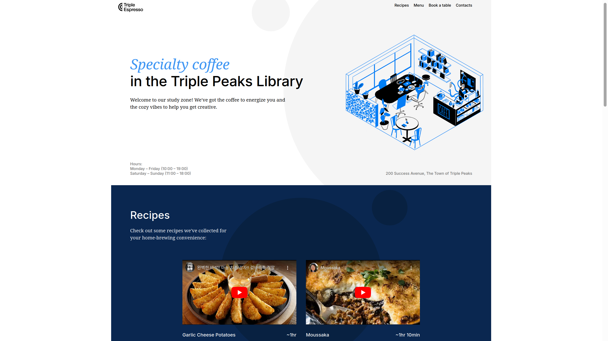

# Triple Peaks Coffee Shop

_Somewhere, in the town of Triple Peaks, there is a library that nurtures success not only in the hard skills for the coding-inclined, but also in the soft skills to further one's social achievements beyond just the code._

_But what is a library without a place to relax and wind down after a hard day's work, taking that well-deserved pomodoro break time, or even just to hang out?_

_This is where I step in. ~Cyberbarista Andy_

## What is it?

This is the 2nd project of the Software Engineering program at [TripleTen](https://tripleten.co.il). It was created using HTML and CSS, based on the design brief and recommendations from fellow tutors and students in the respective Discord server.

## Project features

1. Semantic **HTML5**
2. **CSS** animation & transform
3. Flexbox
4. Positioning
5. The BEM convention (for pages & files)
6. A custom form

## Suggestions for improvement

- a Dark Mode theme for the late hours of the night
- some community-driven polls for rotating the menus
- and some more stuff :)

## [Link to project website](https://pragmaticLudusian.github.io/se_project_coffeeshop)